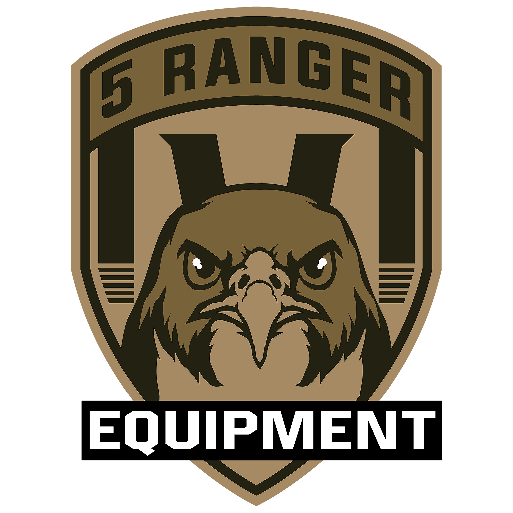

# mission-template

Main mission template for the 5 RANGER Arma 3 unit.

[GitHub](https://https://github.com/5ranger/mission-template/)

## Overview
An Arma 3 template for the 5 RANGER community, providing essential assets and functions for mission makers, gameplay and immersion.

## Features
- **ACE3 Integration**: Pre-configured ACE3 medical, interaction, and logistics systems for immersive gameplay.
- **Dynamic Respawn System**: Add and remove respawn positions dynamically via ACE interact menu.
- **Logistics Actions**:
	- Deploy and pack radio relays with progress bars and ACE actions.
	- Create and load empty supply crates (ammo, weapons, fuel) at vehicle sides.
	- ViV (Vehicle-in-Vehicle) loading for compatible crates and vehicles.
- **Dynamic Simulation Management**: Automatic enabling/disabling of Arma 3's dynamic simulation for performance optimization.
- **Custom Functions Library**: Modular SQF functions for common tasks - marker management, arsenal setup, cargo initialization, etc.
- **Mission Framework**:
	- Pre-built mission structure with `description.ext`, `init.sqf`, and server/client init scripts.
	- Example mission objects and configuration for quick setup.
- **SFX Support**: Custom sound effects for immersive and fun mission events.
- **Zeus & Admin Tools**: Fixes and enhancements for Zeus and admin gameplay.

## Installation
### Manual
1. Download the [latest release](https://github.com/5ranger/mission-template/releases/latest).
2. Unpack the mission PBO into `Documents/Arma 3 (- Other Profiles)/(mp)missions` using your preferred Arma 3 packing tool.
3. Launch Arma 3, open the editor, load the mission file.

## Building From Source
#### Recommended outline
> Ensure [HEMTT](https://github.com/BrettMayson/HEMTT/tree/main) >=v1.17.2 is installed
1. Increment version if introducing new content (update `script_version.hpp`).
2. Run `hemtt release`, observe result in `.hemttout/release`
3. Test in a local editor scenario
4. Tag release (e.g., `v1.1.0`) and push.

#### Manual
1. Increment version if introducing new content (update `script_version.hpp`).
2. Pack subfolder to PBO's (`5r_mission_template.VR.pbo`).
3. Test in a local editor scenario
4. Tag release (e.g., `v1.1.0`) and push.

## Integration
Place the contents of the downloaded PBO into your mission root.

## Signing / Keys
The `keys/5r_main.bikey` public key is included for server verification. Server admins should place it into their server `keys` directory. The private key must remain secret.

## CI/CD
Integration and Deployment is managed through HEMTT and the `.github/workflows/hemtt.yml`. \
Any tags will automatically build, release and upload the mod to GitHub.

## Credits
- **Author:** Deadly
- **Community:** 5 RANGER
- **Website:** [5ranger.cc](https://5ranger.cc)

## Support / Issues
Report to the [organization's issue repo](https://github.com/5ranger/j6-issues/issues). \
Please include RPT excerpts and reproduction steps where possible.

## Versioning
Semantic versioning MAJOR.MINOR.PATCH is followed in `script_version.hpp`:
- MAJOR: Breaking changes / large sets of new assets
- MINOR: New gear variants / balancing adjustments
- PATCH: Fixes & polish (no content additions)

---

For more information, visit our [website](https://5ranger.cc) or join us on Steam.
